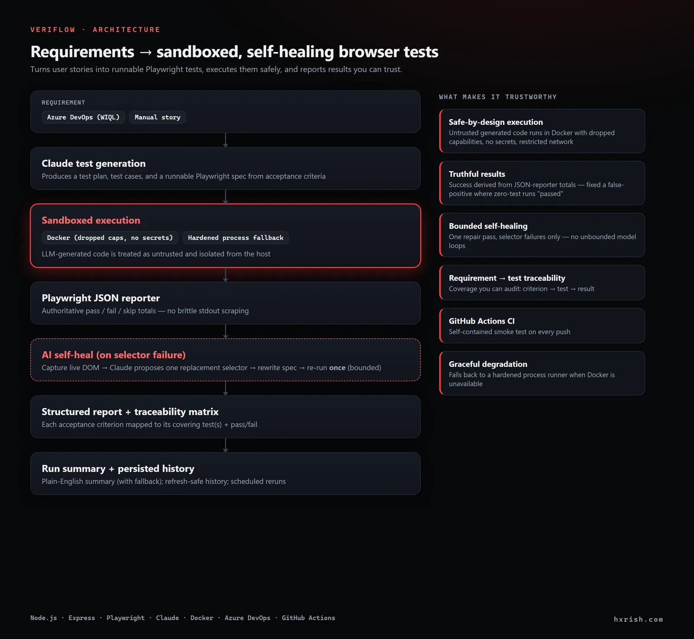
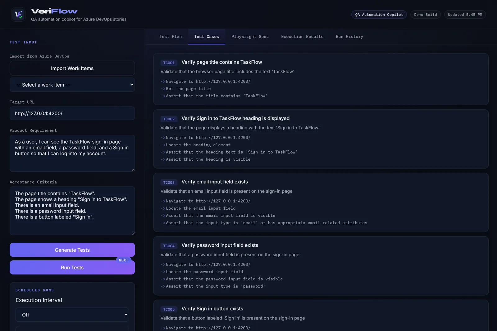
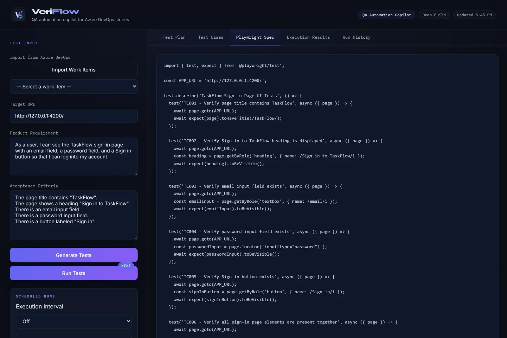
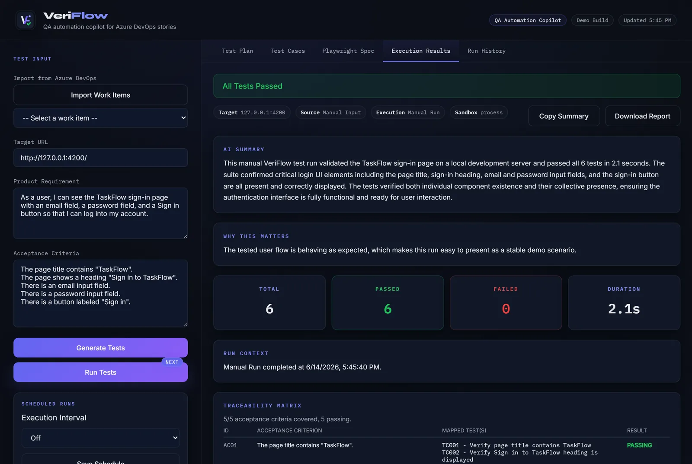
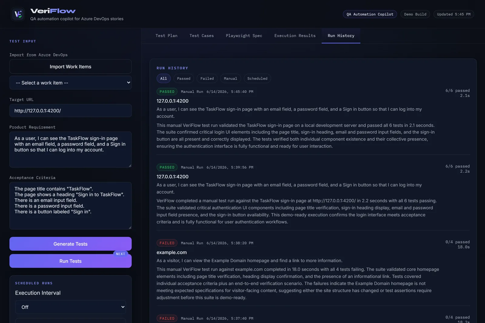

# VeriFlow

VeriFlow is a QA automation copilot that turns Azure DevOps requirements into Playwright test coverage, executes the generated spec, and presents the results in a reviewable UI.

It is built as a lightweight internal-tool style MVP focused on a practical workflow:

1. Import a work item from Azure DevOps or enter a requirement manually
2. Generate a test plan, test cases, and a runnable Playwright spec
3. Execute the generated suite against a target URL
4. Review the result summary, per-test outcomes, and saved run history

## System overview

This diagram shows how VeriFlow moves from requirement input to AI-generated Playwright coverage, browser execution, and reviewable reporting outputs.



## Why this project exists

Product and QA teams often describe behavior in user stories and acceptance criteria, while automation lives separately in test code. VeriFlow closes that gap by converting requirement text into executable browser tests and making the output easy to review.

## Core features

- Azure DevOps work-item import
- Story-to-test generation from requirements and acceptance criteria
- Playwright spec generation using ES module syntax
- In-app execution results with totals, durations, and per-test outcomes
- Plain-English run summaries for quick review
- Saved run history with filtering
- Scheduled reruns while the server is active
- Sandboxed execution of AI-generated tests (Docker, with a hardened process fallback)
- AI self-healing of broken selectors (bounded to one repair pass per run)
- Requirement-to-test traceability matrix surfaced in the report
- GitHub Actions CI with a self-contained smoke test (no Azure DevOps needed)

## Tech stack

- Node.js
- Express
- Playwright
- Vanilla HTML/CSS/JavaScript frontend
- Anthropic API for test generation and summary generation

## Local setup

### 1. Install dependencies

```bash
npm install
npx playwright install
```

### 2. Create `.env`

Copy `.env.example` to `.env` and set:

```bash
ANTHROPIC_API_KEY=your_key_here
AZURE_DEVOPS_ORG=your_org
AZURE_DEVOPS_PROJECT=your_project
AZURE_DEVOPS_PAT=your_pat
PORT=3001
# Optional: sandbox mode (docker | process). Defaults to docker if available, else process.
VERIFLOW_SANDBOX=
# Optional: Docker sandbox network (default none; use bridge for public sites).
VERIFLOW_DOCKER_NETWORK=
```

### 3. Start the app

```bash
npm start
```

Then open:

```text
http://localhost:3001
```

## Demo flow

For a quick demo:

1. Import an Azure DevOps work item or enter a requirement manually
2. Use `https://wikipedia.org` as the target URL
3. Generate tests from the requirement
4. Run the generated Playwright suite
5. Review `Execution Results` and `Run History`

## Demo scenarios

These are the four stable showcase scenarios used in development and demo prep.

### 1. Wikipedia search

- Target URL: `https://wikipedia.org`
- User story: `As a user, I want to search the site so that I can find information quickly`

Acceptance criteria:

- A search input field is visible on the homepage
- A user can type a query into the search input
- A user can submit the search using Enter or the search action
- Relevant search results are displayed after submission

### 2. Python homepage

- Target URL: `https://www.python.org`
- User story: `As a user, I want to navigate to the homepage so that I can see the main content`

Acceptance criteria:

- The homepage loads successfully
- The Python logo or site branding is visible
- Primary navigation links are visible
- The main page content is displayed

### 3. ExpandTesting form validation

- Target URL: `https://practice.expandtesting.com/form-validation`
- User story: `As a user, I want to see error messages so that I understand what went wrong`

Acceptance criteria:

- Required form fields are visible
- Submitting the form with empty required fields shows validation feedback
- Validation feedback remains visible after submission
- A user can identify which fields still need correction

### 4. The Internet navigation

- Target URL: `https://the-internet.herokuapp.com`
- User story: `As a user, I want to click on links so that I can navigate between pages`

Acceptance criteria:

- A list of visible links is displayed on the homepage
- A user can click a visible link
- Clicking a link navigates to a different page
- The destination page displays a visible heading or main content

## Security and reliability features

### 1. Sandboxed test execution

AI-generated test code is untrusted. VeriFlow never runs it directly against the
host shell or with the server's secrets in scope. Instead `server/sandbox.js`
executes the suite in an isolated sandbox:

- **Docker (preferred):** runs in the official Playwright image
  (`mcr.microsoft.com/playwright:v<matching-version>-jammy`) with browsers
  preinstalled. The container gets `--cap-drop ALL`, `--security-opt
  no-new-privileges`, no host env / secrets (`--env-file /dev/null`), and a
  restricted network (default `none`). Only the project directory is mounted so
  `results.json` is written back and parsed exactly as before.
- **Hardened process fallback:** when Docker is unavailable, the suite runs via
  the local Playwright CLI invoked with `node <cli> test`, no shell, and a
  stripped environment that excludes `ANTHROPIC_API_KEY`, `AZURE_DEVOPS_PAT`,
  and every other secret.

Control with `VERIFLOW_SANDBOX=docker|process` (default: docker if the daemon is
reachable, otherwise process). The mode that actually ran is shown in the report.

### 2. AI self-healing tests

When a generated test fails on a selector problem, `server/selfheal.js` captures
the live page DOM and the error, asks Claude for one repaired selector, applies
it to the spec, and re-runs the suite **once** (bounded, at most one repair pass
per run, never loops). Every repair is recorded as `old -> new` and surfaced in
the report under "AI Self-Healed Selectors".

### 3. CI and traceability matrix

- `.github/workflows/ci.yml` installs dependencies, installs Playwright
  browsers, runs `node --check` on the server/test sources, lints if a `lint`
  script exists, and runs a self-contained smoke test against a local HTML
  fixture (no Azure DevOps, no credentials).
- After every run, `server/traceability.js` maps each acceptance criterion to
  the generated test(s) covering it and folds in their pass/fail result. The
  matrix is written to `generated/traceability.json`, returned in the run report,
  exposed at `GET /traceability`, and rendered as a "Traceability Matrix" table
  in the UI.

Run the smoke checks locally:

```bash
npm run smoke        # end-to-end: sandbox -> results.json -> traceability.json
npm run smoke:spec   # the self-contained Playwright smoke spec
```

## Screenshots

### Generated test cases

Test cases produced by Claude from a user story plus its acceptance criteria.



### Playwright spec

The runnable Playwright spec generated for the requirement.



### Execution results + traceability

Authoritative pass/fail totals, the sandbox mode, and a requirement → test traceability matrix.



### Run history



## Project structure

```text
veriflow/
  client/
    assets/
    index.html
  server/
    data/
    index.js
    sandbox.js
    selfheal.js
    traceability.js
  generated/
    generated.spec.js
    traceability.json
  tests/
    smoke/
  .github/
    workflows/
      ci.yml
  playwright.config.js
  package.json
```

## API endpoints

| Method | Path | Purpose |
| --- | --- | --- |
| GET | `/azure-stories` | Fetch recent Azure DevOps user stories and issues |
| POST | `/generate-tests` | Generate a test plan, test cases, and Playwright code |
| POST | `/run-tests` | Execute the generated spec and return a structured report |
| GET | `/generated-code` | Return the saved generated Playwright spec |
| GET | `/run-history` | Return persisted execution history |
| GET | `/traceability` | Return the latest requirement-to-test traceability matrix |
| GET | `/schedule` | Return current scheduled execution state |
| POST | `/schedule` | Turn scheduled execution off or set `5m`, `30m`, or `1h` |

## Notes

- Generated specs are written to `generated/generated.spec.js`
- The traceability matrix is written to `generated/traceability.json`
- Run history is persisted by the server for refresh-safe viewing
- Scheduled execution is designed for demo/prototype use while the local server is running
